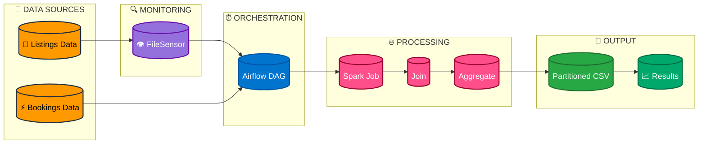

# Event-Driven Data Pipeline for Performance Analytics (Airflow & Spark)

## 📌 Project Overview

This project demonstrates a production-style, event-driven data pipeline built using Apache Airflow and Apache Spark.

The pipeline simulates real-world data engineering challenges by dynamically waiting for upstream data (listings) before processing incoming booking data, ensuring reliability and preventing pipeline failures.

---

## 🚨 The Problem

Traditional batch pipelines are often brittle:

* They fail when upstream data is delayed
* They require manual intervention
* They produce inaccurate or incomplete analytics

---

## 💡 The Solution

An automated, event-driven ETL pipeline that:

* Waits for required data using a FileSensor
* Dynamically adapts to new time periods without code changes
* Processes and joins data using Apache Spark
* Produces aggregated performance metrics

---

## ⚙️ Tech Stack

* Apache Airflow (Workflow Orchestration)
* Apache Spark / PySpark (Data Processing)
* Python
* CSV Data Processing
* Ubuntu (WSL Environment)

---

## 🔄 Pipeline Architecture

1. FileSensor monitors for incoming listings data
2. Booking data is generated dynamically
3. Spark job is triggered via Airflow
4. Listings and bookings are joined
5. Aggregation calculates bookings per listing
6. Results are written to partitioned output

## 🔄 Pipeline Graphical Architecture

---

## 🧠 Key Technical Achievements

### ✅ Event-Driven Orchestration

* Implemented FileSensor to prevent downstream execution until data is available
* Used `mode="reschedule"` to optimize resource usage

### ✅ Dynamic Pipeline Design

* Leveraged Jinja templating (`logical_date`) for automatic monthly scaling
* No manual code updates required for new time periods

### ✅ Spark Integration

* Used SparkSubmitOperator to execute PySpark jobs
* Performed joins and aggregations on large datasets

### ✅ Data Quality & Error Handling

* Resolved Spark casting errors caused by malformed CSV data
* Implemented defensive data handling (`try_cast`, permissive mode)
* Handled real-world ingestion issues (including compression-related errors)

---

## 📊 Output

The pipeline generates:

* listing_id
* listing_name
* price
* booking_count

Stored in partitioned directories for efficient querying.

---

## 📸 Screenshots

---

## 🚀 Future Improvements

* Integrate with AWS S3 for scalable storage
* Execute Spark jobs on EMR
* Query results using Amazon Athena
* Add automated data quality validation layer
* Support compressed formats (e.g., Gzip ingestion)

---

## 💡 Key Learning

This project highlights:

* Building resilient data pipelines
* Event-driven orchestration
* Handling dirty and unpredictable data
* Designing scalable and maintainable ETL systems

---

## 👨‍💻 Author

Aspiring Data Engineer building real-world data pipelines using Airflow and Spark.
